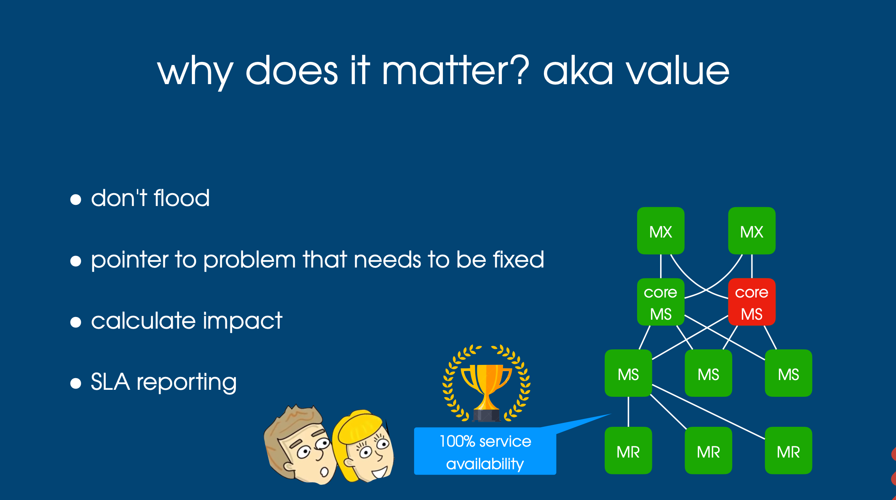
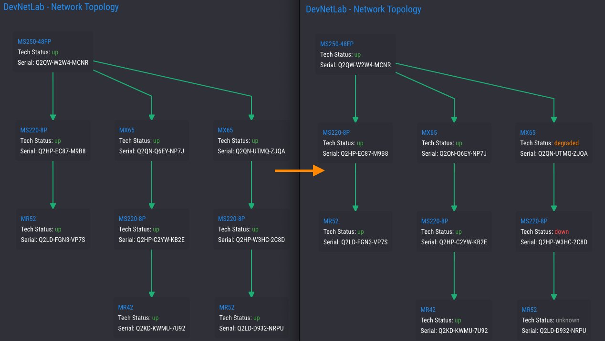
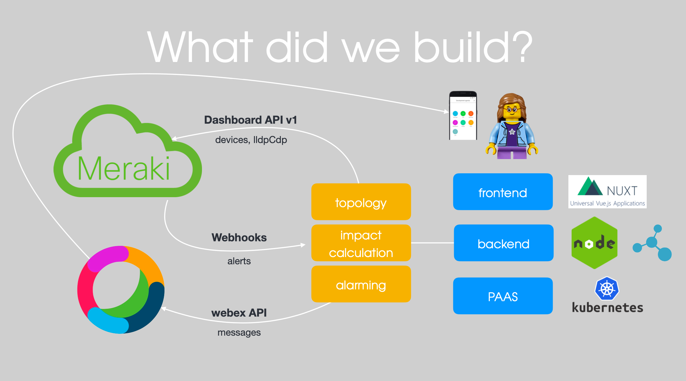

# Meraki Root Cause Detection

## About

`Meraki Root Cause Detection` is an application to visualize meraki network topology - and to classify meraki alerts in order to report incidents only for the root cause instead of for the complete network.

## What's behind

We use meraki lldp and cdp information together with the device statuses to build a forced directed network graph for each network. As this process is somewhat expensive to execute with respect to the amount of api calls as well as the compution of the forced directed network graph, we make use of [Moleculer caches](https://moleculer.services/docs/0.14/caching.html#content-inner) to store information locally (in general for 30 minutes). In addition we listen to [meraki webhook alerts](https://documentation.meraki.com/zGeneral_Administration/Other_Topics/Webhooks) and classify incoming alerts so that we are able to clean affected caches (sources) if necessary.

## How it looks like

## Tech stack

## Development and Production setup

Check out the [Backend](./backend/README.md) and [Frontend](./frontend/README.md) documentation to get started.
